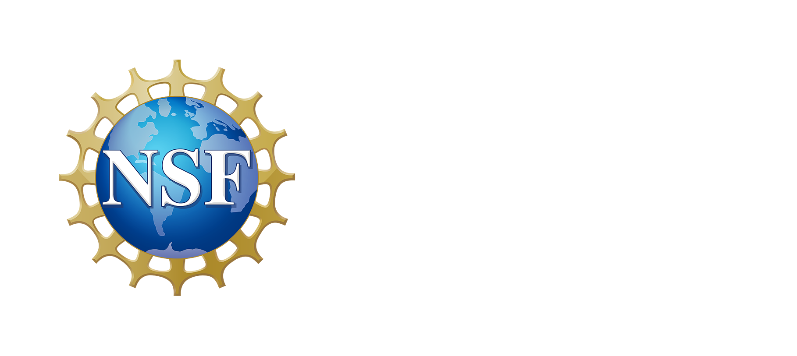

# v-v_dashboard (DET Viewer)

Dash app + AWS CDK stack for the DET “viewer”.
**What it does:** serves a Dash web app on ECS Fargate behind an ALB, exposes a small API Gateway endpoint for status checks, and invokes a Lambda container during uploads. Data lives in an existing S3 bucket and DynamoDB table.

---

## CI/CD Pipeline (Recommended)

This repo ships with GitHub Actions. Deploys are pinned to **us-west-2** and the workflow updates the existing **`DashboardStack`** (no new stacks).

### CI (Continuous Integration)

* **Trigger:** runs on pushes to `ci/test` and on PRs to `main`.
* **Actions:** Ruff lint, pytest, and quick Docker build sanity checks.

### CD (Continuous Delivery)

* **Trigger:**

  * Automatically on pushes to `ci/test`, **or**
  * Manually via **Actions → deploy-dev → Run workflow** (you can use `Branch: main`).
* **What it does:** Uses AWS **OIDC** (no stored keys), builds & pushes the app and Lambda images to **ECR in `us-west-2`**, deploys **`DashboardStack`** with CDK, then smoke-tests the ALB and status API.

> The workflow also exposes a `DEPLOY_REGION` env var and is locked to `us-west-2`.

---

## How to Deploy

### Option A — Push to the CI branch

```bash
git push origin ci/test
```

This triggers the `ci` and `deploy-dev` workflows automatically.

### Option B — Run it manually

1. Go to **Actions → deploy-dev**.
2. Click **Run workflow**, choose **Branch: main** (or a branch you want), leave the tag empty, and run.

You can follow progress in the job logs.

---

## Verify the deployment (Smoke Test)

Fetch the live URLs from the stack outputs and curl them:

```bash
STACK="DashboardStack"
REGION="us-west-2"

ALB_URL=$(aws cloudformation describe-stacks --stack-name "$STACK" --region "$REGION" \
  --query "Stacks[0].Outputs[?OutputKey=='ServiceURL'].OutputValue" --output text)

API_URL=$(aws cloudformation describe-stacks --stack-name "$STACK" --region "$REGION" \
  --query "Stacks[0].Outputs[?OutputKey=='StatusAPIHealthURL'].OutputValue" --output text)

echo "--- ALB: $ALB_URL"
curl -fsS "$ALB_URL" | head -n 10

echo "--- API: $API_URL"
curl -fsS "$API_URL"
```

---

## Destroy the environment (when you’re done)

Preferred: run **Actions → destroy-dev → Run workflow** (choose the branch the stack was deployed from).

---

## Local Development Setup

**Prereqs**

* Docker (with `buildx`)
* AWS CLI v2
* Python 3.9+
* Node.js 20+ and CDK v2 (`npm i -g aws-cdk`)

### 1) Python env & deps

```bash
python -m venv .venv
# macOS/Linux
source .venv/bin/activate
# Windows PowerShell
# .\.venv\Scripts\Activate.ps1

pip install -r requirements.txt
pip install -r cdk/requirements.txt
```

### 2) One-time AWS/ECR login (for manual builds)

```bash
export AWS_REGION=us-west-2
export AWS_ACCOUNT_ID=$(aws sts get-caller-identity --query Account --output text)

aws ecr get-login-password --region "$AWS_REGION" \
| docker login --username AWS --password-stdin \
  "$AWS_ACCOUNT_ID.dkr.ecr.$AWS_REGION.amazonaws.com"
```

After that, you can run `cdk synth/deploy` locally if needed.

---

## Acknowledgments

<table>
  <tr>
    <td align="center" valign="middle">
      
    </td>
    <td align="center" valign="middle">
      
    </td>
  </tr>
</table>

CRESCENT is funded by NSF cooperative agreement #2225286 and is also supported by the Pacific Gas and Electric Company (PG&E).
